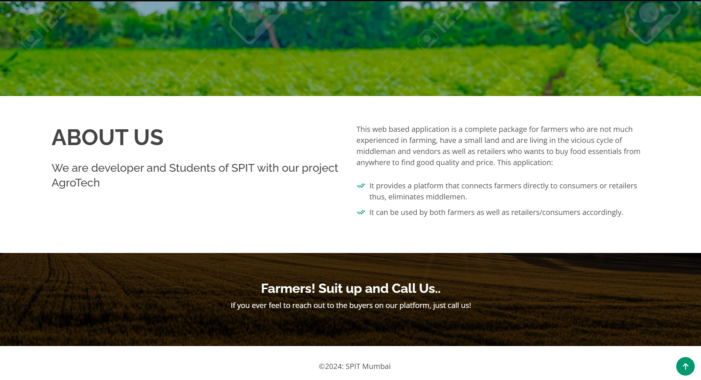

# AgroTech

## Features

<!--  -->

 In this project, we are providing a farmer friendly web-based app that gives complete information about what crop to grow, what fertilizers and pesticides to use depending upon land condition and weather conditions.
 
 It also provides a platform that connects farmers directly to consumers or retailers thus, eliminates middlemen. This web application can be used by both farmers as well as retailers/consumers accordingly.
 
 <!--  -->

 
 ## Installation Steps:
 
 1. pip install virtualenv
 2. python -m venv ve
 3. pip install django pillow joblib sklearn
 4. python manage.py runserver

## Happy to receive comments
